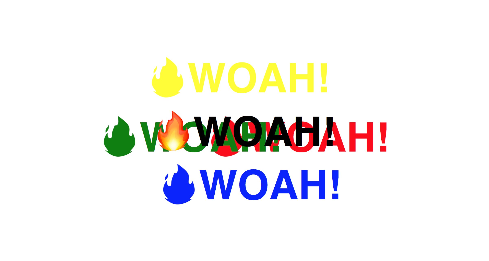

# MouseShadow

Day 16 of Javascript30 by WesBos. Made a website where shadows of the specified word will appear and move with your mouse movement.

# Demo

# Technologies Used

HTML5, CSS, Vanilla JS

# Website

https://buigabor.github.io/mouse-shadow/
